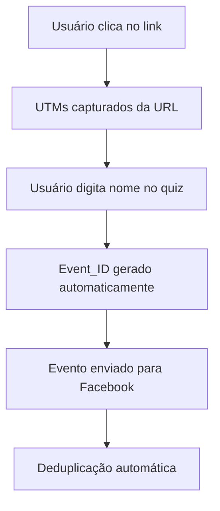

# 🎯 ESCLARECIMENTOS: UTM, IDs e Sistema de Tracking

## 📝 RESUMO DAS SUAS DÚVIDAS

Você perguntou:
1. **Se o ID seria o nome que a pessoa digita no começo do quiz**
2. **Se esse ID pode ser um parâmetro UTM**
3. **Como funcionam os UTMs na prática**
4. **Entender melhor o sistema de deduplicação implementado**

---

## 🆔 DIFERENÇA ENTRE NOME DO USUÁRIO E EVENT_ID

### ❌ **CONFUSÃO COMUM**
O **nome que a pessoa digita no quiz** ≠ **event_id do Facebook Pixel**

### ✅ **REALIDADE**

#### 👤 **NOME DO USUÁRIO** (o que a pessoa digita)
```typescript
// Arquivo: src/components/quiz/AnimatedNameForm.tsx
const [nome, setNome] = useState(''); // ← Isso é o NOME da pessoa

// Exemplos:
"Maria Silva"
"João Santos" 
"Ana Costa"
```

**📍 ONDE É USADO:**
- Personalização da experiência ("Olá, Maria!")
- Armazenado no `localStorage.getItem('userName')`
- Enviado para analytics como `username` ou `user_name`

#### 🔑 **EVENT_ID** (identificador único do evento)
```typescript
// Arquivo: src/utils/analytics.ts
const eventId = `${eventType}_${sessionId}_${timestamp}_${btoa(dataHash).slice(0, 8)}`;

// Exemplos:
"QuizStart_abc123_1703123456789_dGVzdA=="
"Lead_abc123_1703123456790_bGVhZA=="
"Purchase_abc123_1703123456791_cHVyY2g="
```

**📍 ONDE É USADO:**
- Deduplicação no Facebook Pixel
- Controlar eventos duplicados
- Rastreamento interno do sistema

---

## 🎯 UTM PARAMETERS - COMO FUNCIONAM NA PRÁTICA

### 🌐 **O QUE SÃO UTMs**
UTMs são **parâmetros na URL** que identificam de onde o usuário veio.

### 📊 **EXEMPLO PRÁTICO**

#### 🔗 **URL COM UTMs:**
```
https://giselegalvao.com.br/quiz?utm_source=facebook&utm_medium=social&utm_campaign=quiz_promo&utm_content=botao_azul
```

#### 📋 **PARÂMETROS CAPTURADOS:**
```javascript
{
  "utm_source": "facebook",     // ← DE ONDE veio
  "utm_medium": "social",       // ← COMO veio (social, email, cpc)
  "utm_campaign": "quiz_promo", // ← QUAL campanha
  "utm_content": "botao_azul"   // ← QUAL versão/conteúdo
}
```

### 🤖 **CAPTURA AUTOMÁTICA**
```typescript
// Arquivo: src/hooks/useUtmParameters.ts
const captureUtmParameters = (): UtmParameters => {
  const urlParams = new URLSearchParams(window.location.search);
  const utmParams: UtmParameters = {};
  
  // Captura automática dos parâmetros
  if (urlParams.has('utm_source')) utmParams.source = urlParams.get('utm_source');
  if (urlParams.has('utm_medium')) utmParams.medium = urlParams.get('utm_medium');
  // ... outros parâmetros
  
  // Salva no localStorage para usar depois
  localStorage.setItem('utm_parameters', JSON.stringify(utmParams));
  
  return utmParams;
};
```

---

## 🔄 **O NOME PODE SER UM PARÂMETRO UTM?**

### ✅ **SIM, É POSSÍVEL (mas não recomendado)**

#### 🎯 **EXEMPLO TEÓRICO:**
```
https://giselegalvao.com.br/quiz?utm_source=email&utm_content=maria_silva
```

#### 📊 **COMO SERIA CAPTURADO:**
```javascript
{
  "utm_source": "email",
  "utm_content": "maria_silva"  // ← Nome como parâmetro UTM
}
```

### ❌ **POR QUE NÃO É RECOMENDADO:**

1. **🔒 Privacidade:** Nomes ficam visíveis na URL
2. **📊 Analytics:** UTMs são para campanhas, não dados pessoais
3. **🛠️ Manutenção:** Complicaria o sistema desnecessariamente
4. **📈 Relatórios:** Poluiria as estatísticas de campanha

### ✅ **MELHOR ABORDAGEM (atual):**
- **UTMs:** Para identificar campanhas
- **Nome:** Coletado via formulário (seguro e privado)

---

## 🔧 SISTEMA ATUAL DE TRACKING

### 📊 **FLUXO COMPLETO:**



### 🎯 **EXEMPLO REAL:**

#### 1️⃣ **Usuário clica em:**
```
https://giselegalvao.com.br/quiz?utm_source=instagram&utm_campaign=dezembro2024
```

#### 2️⃣ **Sistema captura UTMs:**
```javascript
{
  "utm_source": "instagram",
  "utm_campaign": "dezembro2024"
}
```

#### 3️⃣ **Usuário digita nome:**
```
"Maria Silva"
```

#### 4️⃣ **Sistema gera event_id:**
```
"QuizStart_abc123_1703123456789_dGVzdA=="
```

#### 5️⃣ **Evento final enviado:**
```javascript
{
  "event_id": "QuizStart_abc123_1703123456789_dGVzdA==",
  "username": "Maria Silva",
  "utm_source": "instagram",
  "utm_campaign": "dezembro2024",
  "timestamp": 1703123456789
}
```

---

## 🛡️ SISTEMA DE DEDUPLICAÇÃO

### 🎯 **OBJETIVO:**
Evitar que o mesmo evento seja enviado múltiplas vezes para o Facebook.

### 🔧 **COMO FUNCIONA:**

#### 1️⃣ **Geração de ID Único:**
```typescript
const generateEventId = (eventType: string, eventData: any): string => {
  const sessionId = getOrCreateSessionId();
  const timestamp = Date.now();
  const dataString = JSON.stringify(eventData);
  const dataHash = btoa(dataString).slice(0, 8);
  
  return `${eventType}_${sessionId}_${timestamp}_${dataHash}`;
};
```

#### 2️⃣ **Controle de Duplicatas:**
```typescript
const sentEvents = new Set<string>();

const sendFacebookEvent = (eventType: string, eventName: string, eventData: any) => {
  const eventId = generateEventId(eventName, eventData);
  
  // Verifica se já foi enviado
  if (sentEvents.has(eventId)) {
    console.log('Evento já enviado, ignorando duplicata:', eventId);
    return;
  }
  
  // Marca como enviado
  sentEvents.add(eventId);
  
  // Envia para Facebook
  fbq(eventType, eventName, { ...eventData, event_id: eventId });
};
```

---

## 📊 EXEMPLOS PRÁTICOS DE USO

### 🎯 **CENÁRIO 1: Campanha no Instagram**
```
Link: https://giselegalvao.com.br/quiz?utm_source=instagram&utm_medium=social&utm_campaign=black_friday

Resultado:
✅ UTM capturado: "instagram/social/black_friday"
✅ Usuário digita: "Ana Costa"  
✅ Event_ID gerado: "QuizStart_xyz789_1703123456789_YW5h"
✅ Evento enviado SEM duplicatas
```

### 🎯 **CENÁRIO 2: Email Marketing**
```
Link: https://giselegalvao.com.br/quiz?utm_source=email&utm_medium=newsletter&utm_campaign=dezembro&utm_content=botao_cta

Resultado:
✅ UTM capturado: "email/newsletter/dezembro/botao_cta"
✅ Usuário digita: "João Silva"
✅ Event_ID gerado: "QuizStart_def456_1703123456790_am9h"
✅ Rastreamento completo da jornada
```

---

## 🎨 INTERFACE DE MONITORAMENTO

### 📊 **DASHBOARD UTM (já implementado):**
- **📈 Gráficos por fonte** (Instagram, Facebook, Email)
- **📊 Campanhas mais efetivas**
- **💰 Taxa de conversão por canal**
- **📅 Histórico temporal**

### 🔍 **RELATÓRIOS DISPONÍVEIS:**
1. **🎯 Por origem:** Quantos leads vieram do Instagram vs Facebook
2. **📈 Por campanha:** Qual campanha converteu mais
3. **💰 ROI por canal:** Custo vs conversão de cada fonte
4. **👥 Perfil de usuário:** Dados demográficos por origem

---

## ✅ CONCLUSÃO

### 🎯 **SEPARAÇÃO CLARA:**
- **👤 Nome do usuário:** Personalização (Maria, João, Ana)
- **🆔 Event_ID:** Deduplicação técnica (QuizStart_abc123_...)
- **📊 UTM:** Origem da campanha (instagram, email, facebook)

### 🛡️ **SISTEMA ROBUSTO:**
- ✅ Deduplicação automática
- ✅ Captura UTM automática  
- ✅ Rastreamento completo
- ✅ Privacidade protegida
- ✅ Analytics detalhados

### 🚀 **RESULTADO:**
Você tem um sistema profissional que rastreia **TUDO** sem duplicatas, respeitando a privacidade e fornecendo insights valiosos para otimizar suas campanhas!

---

**💡 Alguma dúvida específica sobre algum desses pontos?**
