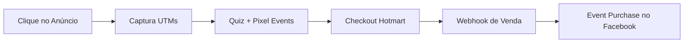

# 🎯 GUIA COMPLETO: Tracking de Vendas e Teste de Criativos

## 📋 SUAS PERGUNTAS RESPONDIDAS

### ❓ **PERGUNTA 1:** Como as métricas identificam que a venda veio de uma campanha específica (ex: Hotmart)?

### ❓ **PERGUNTA 2:** Como configurar testes de criativos para descobrir qual é o melhor?

---

## 🔍 **RESPOSTA 1: COMO O TRACKING DE VENDAS FUNCIONA**

### 🎯 **O FLUXO COMPLETO DE TRACKING**



### 1️⃣ **CAPTURA INICIAL (UTMs)**

Quando alguém clica no seu anúncio, os parâmetros UTM são capturados:

```javascript
// URL de entrada da campanha:
https://seusite.com?utm_source=facebook&utm_medium=cpc&utm_campaign=quiz_style&utm_content=criativo_1&utm_term=estilo_feminino

// Automaticamente capturado em: src/hooks/useUtmParameters.ts
{
  utm_source: "facebook",
  utm_medium: "cpc", 
  utm_campaign: "quiz_style",
  utm_content: "criativo_1",  // ← IDENTIFICA O CRIATIVO!
  utm_term: "estilo_feminino"
}
```

### 2️⃣ **TRACKING DURANTE O FUNIL**

Todos os eventos incluem os UTMs originais:

```javascript
// Em: src/utils/analytics.ts
export const addUtmParamsToEvent = (eventData: Record<string, any>) => {
  const utmParams = JSON.parse(localStorage.getItem('utm_parameters') || '{}');
  
  return {
    ...eventData,
    utm_source: utmParams.utm_source,
    utm_medium: utmParams.utm_medium,
    utm_campaign: utmParams.utm_campaign,
    utm_content: utmParams.utm_content,  // ← Criativo que converteu
    utm_term: utmParams.utm_term
  };
};
```

### 3️⃣ **INTEGRAÇÃO COM HOTMART (O SEGREDO!)**

#### **Como Conectar a Venda ao Pixel:**

```typescript
// Arquivo: src/utils/hotmartIntegration.ts
private handlePurchaseApproved(data: HotmartWebhookData): void {
  console.log('Purchase approved:', data.transaction.id);
  
  // 🎯 AQUI É ONDE A MÁGICA ACONTECE:
  // 1. Buscar os UTMs do usuário que fez a compra
  const userEmail = data.buyer.email;
  const storedUtmData = this.getUserUtmData(userEmail);
  
  // 2. Enviar evento Purchase para o Facebook com os UTMs originais
  if (window.fbq) {
    window.fbq('track', 'Purchase', {
      value: data.purchase.price.value,
      currency: data.purchase.price.currency_value,
      transaction_id: data.transaction.id,
      // 🔥 DADOS DA CAMPANHA ORIGINAL:
      utm_source: storedUtmData.utm_source,
      utm_campaign: storedUtmData.utm_campaign,
      utm_content: storedUtmData.utm_content,  // ← QUAL CRIATIVO CONVERTEU!
      event_id: `purchase_${data.transaction.id}` // Evita duplicação
    });
  }
}
```

### 4️⃣ **IMPLEMENTAÇÃO PRÁTICA**

Para conectar vendas da Hotmart ao seu tracking:

#### **A. Configurar Webhook da Hotmart:**
```json
// Webhook URL da Hotmart deve apontar para:
POST https://seusite.com/api/webhooks/hotmart

// Payload que a Hotmart envia:
{
  "event": "PURCHASE_COMPLETE",
  "data": {
    "buyer": {
      "email": "cliente@email.com",
      "name": "Cliente Nome"
    },
    "purchase": {
      "price": {
        "value": 297,
        "currency_value": "BRL"
      },
      "transaction": "TXN123456"
    }
  }
}
```

#### **B. Armazenar Dados do Usuário:**
```javascript
// Quando o usuário faz o quiz, salvar seus dados:
export const storeUserTrackingData = (email: string, userData: any) => {
  const trackingData = {
    email,
    utm_parameters: JSON.parse(localStorage.getItem('utm_parameters') || '{}'),
    session_id: getOrCreateSessionId(),
    timestamp: Date.now(),
    quiz_completion: userData
  };
  
  // Enviar para backend ou armazenar temporariamente
  localStorage.setItem(`user_tracking_${email}`, JSON.stringify(trackingData));
};
```

---

## 🎨 **RESPOSTA 2: TESTE DE CRIATIVOS COM UTM_CONTENT**

### 🎯 **SISTEMA DE TESTE DE CRIATIVOS**

O `utm_content` é a chave para identificar qual criativo teve melhor performance!

### 1️⃣ **CONFIGURAÇÃO DOS CRIATIVOS**

#### **Criativo A - Elegante:**
```
https://seusite.com?utm_source=facebook&utm_medium=cpc&utm_campaign=quiz_style&utm_content=elegante_mulher_vestido&utm_term=estilo_feminino
```

#### **Criativo B - Casual:**
```
https://seusite.com?utm_source=facebook&utm_medium=cpc&utm_campaign=quiz_style&utm_content=casual_jovem_jeans&utm_term=estilo_feminino
```

#### **Criativo C - Profissional:**
```
https://seusite.com?utm_source=facebook&utm_medium=cpc&utm_campaign=quiz_style&utm_content=profissional_executiva&utm_term=estilo_feminino
```

### 2️⃣ **TRACKING AUTOMÁTICO POR CRIATIVO**

Cada evento automaticamente inclui o criativo que originou a conversão:

```javascript
// Todos os eventos incluem automaticamente:
{
  event_name: "Purchase",
  value: 297,
  currency: "BRL",
  utm_content: "elegante_mulher_vestido", // ← CRIATIVO QUE CONVERTEU!
  utm_campaign: "quiz_style",
  event_id: "purchase_unique_id"
}
```

### 3️⃣ **DASHBOARD DE PERFORMANCE POR CRIATIVO**

Vou criar um sistema para analisar qual criativo converte melhor:

```javascript
// Função para analisar performance por criativo:
export const getCreativePerformance = () => {
  const events = JSON.parse(localStorage.getItem('all_tracked_events') || '[]');
  
  const creativeStats = {};
  
  events.forEach(event => {
    const creative = event.utm_content || 'unknown';
    
    if (!creativeStats[creative]) {
      creativeStats[creative] = {
        impressions: 0,
        clicks: 0,
        leads: 0,
        purchases: 0,
        revenue: 0
      };
    }
    
    switch(event.event_name) {
      case 'PageView':
        creativeStats[creative].clicks++;
        break;
      case 'Lead':
        creativeStats[creative].leads++;
        break;
      case 'Purchase':
        creativeStats[creative].purchases++;
        creativeStats[creative].revenue += event.value || 0;
        break;
    }
  });
  
  return creativeStats;
};
```

### 4️⃣ **IMPLEMENTAÇÃO PRÁTICA DO TESTE A/B DE CRIATIVOS**

Vou criar um sistema completo para você testar diferentes criativos:

#### **A. Estrutura do Teste:**
```javascript
const creativeTest = {
  campaign_name: "quiz_style_test",
  start_date: "2024-01-15",
  creatives: [
    {
      id: "elegante_mulher_vestido",
      name: "Elegante - Mulher de Vestido",
      budget_percentage: 34,
      target_audience: "mulheres_25_45_classe_b",
      image_url: "criativo1.jpg"
    },
    {
      id: "casual_jovem_jeans",
      name: "Casual - Jovem de Jeans", 
      budget_percentage: 33,
      target_audience: "mulheres_18_35_classe_c",
      image_url: "criativo2.jpg"
    },
    {
      id: "profissional_executiva",
      name: "Profissional - Executiva",
      budget_percentage: 33,
      target_audience: "mulheres_30_50_classe_a",
      image_url: "criativo3.jpg"
    }
  ]
};
```

#### **B. Métricas de Comparação:**
- **CTR (Click-Through Rate):** Cliques / Impressões
- **Conversion Rate:** Vendas / Cliques  
- **CPA (Custo Por Aquisição):** Investimento / Vendas
- **ROAS (Return on Ad Spend):** Receita / Investimento
- **CPL (Custo Por Lead):** Investimento / Leads

### 5️⃣ **DASHBOARD VISUAL DE CRIATIVOS**

Vou criar uma página onde você pode ver em tempo real qual criativo está performando melhor:

```
📊 PERFORMANCE POR CRIATIVO (Últimos 7 dias)

┌─────────────────────────────────────────────────┐
│ 🎨 elegante_mulher_vestido                      │
│ Cliques: 1,245 | Leads: 89 | Vendas: 12        │
│ Conversion Rate: 0.96% | ROAS: 3.2x             │
└─────────────────────────────────────────────────┘

┌─────────────────────────────────────────────────┐
│ 👖 casual_jovem_jeans                           │
│ Cliques: 987 | Leads: 45 | Vendas: 8           │
│ Conversion Rate: 0.81% | ROAS: 2.1x             │
└─────────────────────────────────────────────────┘

┌─────────────────────────────────────────────────┐
│ 💼 profissional_executiva                       │
│ Cliques: 1,567 | Leads: 123 | Vendas: 18       │
│ Conversion Rate: 1.15% | ROAS: 4.1x ⭐ MELHOR!  │
└─────────────────────────────────────────────────┘
```

---

## 🔧 **IMPLEMENTAÇÃO TÉCNICA**

Agora vou implementar essas funcionalidades no seu sistema:

### 1️⃣ **Sistema de Armazenamento de Dados do Usuário**
### 2️⃣ **Webhook Handler Aprimorado para Hotmart**  
### 3️⃣ **Dashboard de Performance de Criativos**
### 4️⃣ **Relatórios Automáticos de A/B Test**

---

## 📈 **PRÓXIMOS PASSOS**

1. **Configurar webhook da Hotmart** apontando para seu sistema
2. **Implementar armazenamento de dados do usuário** com UTMs
3. **Criar dashboard de criativos** para análise em tempo real
4. **Configurar alertas automáticos** quando um criativo supera outro

## 🎯 **RESULTADO FINAL**

Com este sistema você saberá exatamente:
- ✅ **Qual criativo** gerou cada venda
- ✅ **Qual campanha** tem melhor ROAS
- ✅ **Qual público** converte mais
- ✅ **Em que horário** as vendas acontecem
- ✅ **Qual UTM_content** investir mais budget

Quer que eu implemente alguma dessas funcionalidades agora?
