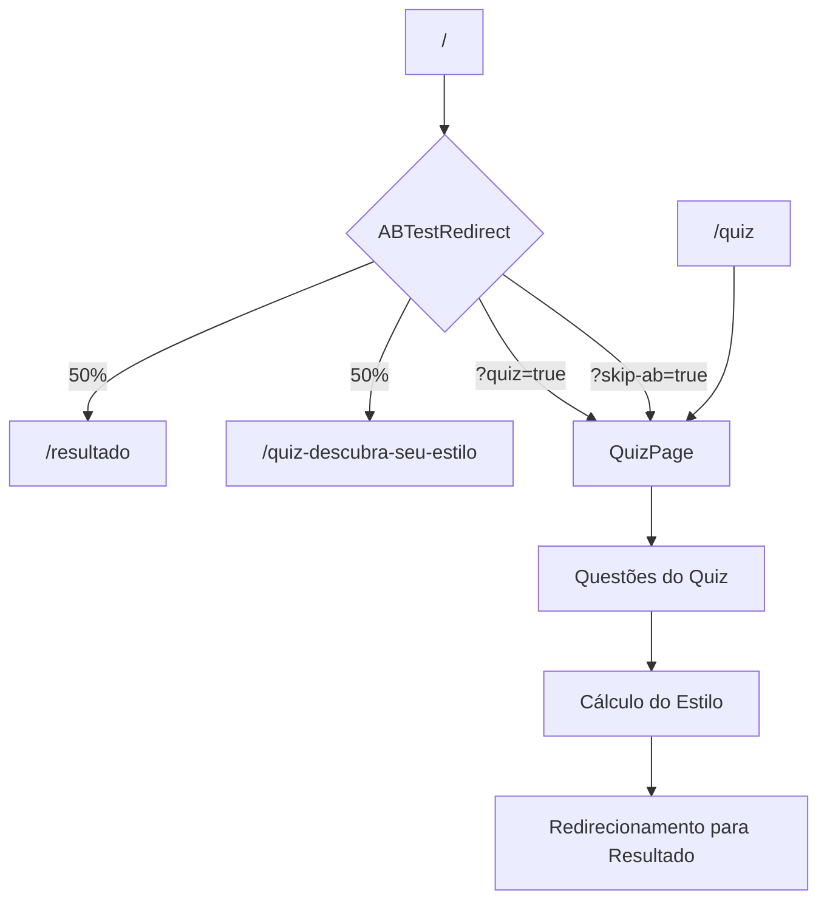
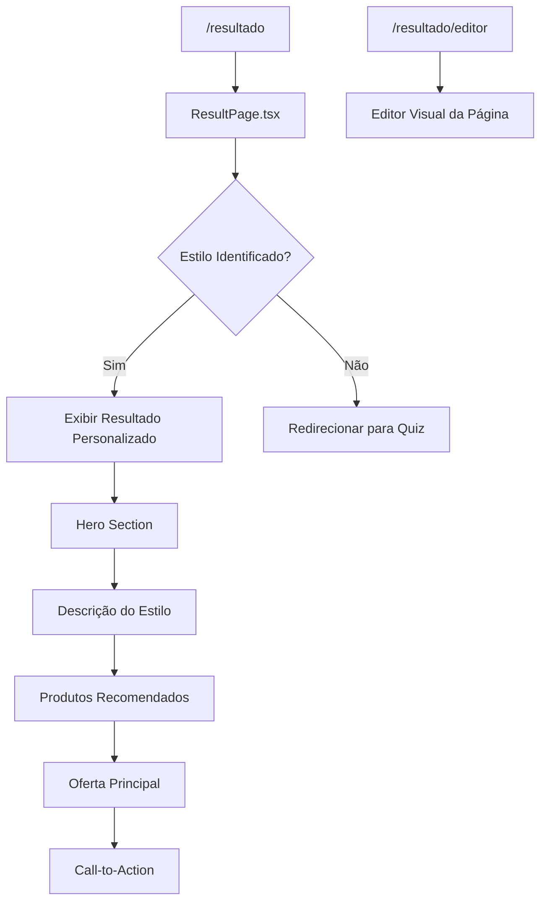
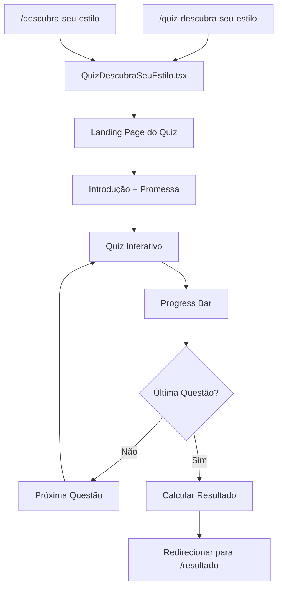
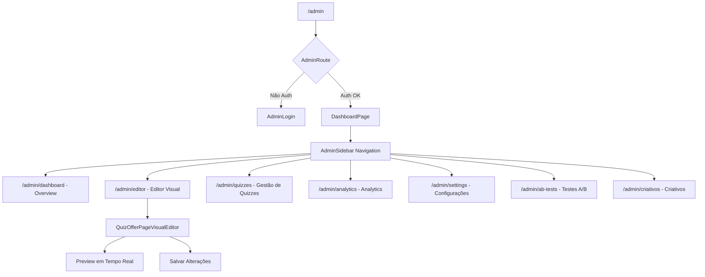

# 🗺️ MAPA MENTAL DAS ROTAS - Quiz Sell Genius

## 🎯 ESTRUTURA PRINCIPAL DO SISTEMA DE ROTEAMENTO

```
🏠 RAIZ DO SISTEMA
│
├── 📱 **SISTEMA SPA ÚNICO** (React Router)
│   ├── 🔧 Entry Point: `/src/main.jsx`
│   ├── 🎯 Router Principal: `/src/App.tsx`
│   └── 🛡️ Providers: AuthProvider → QuizProvider → TooltipProvider
│
└── 🔄 **FLUXO DE NAVEGAÇÃO**
    ├── URL Base → ABTestRedirect → Rota Final
    ├── Autenticação → AdminRoute (se necessário)
    └── Analytics → Tracking → Conversão
```

---

## 🧭 ROTAS PRINCIPAIS MAPEADAS

### 🎯 **1. ROTA RAIZ E QUIZ**



**📍 Arquivos Envolvidos:**
- `/src/pages/LandingPage.tsx` - Página inicial com teste A/B
- `/src/components/QuizPage.tsx` - Componente principal do quiz
- `/src/components/ABTestRedirect.tsx` - Lógica de redirecionamento A/B
- `/src/utils/abtest.ts` - Configuração do teste A/B

**🔧 Funcionalidades:**
- ✅ Teste A/B automático (50/50)
- ✅ Bypass via parâmetros URL (?quiz=true)
- ✅ Preservação de UTM parameters
- ✅ Analytics tracking automático

---

### 🏆 **2. PÁGINA DE RESULTADO**



**📍 Arquivos Envolvidos:**
- `/src/pages/ResultPage.tsx` - Página principal de resultado
- `/src/pages/ResultPagePrototype.tsx` - Protótipo da página
- `/src/components/pages/PreviewQuizOfferPage.tsx` - Preview para admin
- `/src/components/visual-editor/QuizOfferPageVisualEditor.tsx` - Editor visual
- `/src/styles/preview-quiz-offer.css` - Estilos específicos

**🎨 Elementos Visuais:**
- ✅ Hero com resultado personalizado
- ✅ Design responsivo
- ✅ Cores do brand (#B89B7A, #432818, #aa6b5d)
- ✅ CTAs otimizados para conversão
- ✅ Sistema de loading inteligente

---

### 💫 **3. QUIZ DESCUBRA SEU ESTILO**



**📍 Arquivos Envolvidos:**
- `/src/pages/quiz-descubra-seu-estilo.tsx` - Página principal
- `/src/context/QuizContext.tsx` - Estado global do quiz
- `/src/hooks/useQuiz.ts` - Lógica do quiz
- `/src/utils/quizLogic.ts` - Algoritmo de cálculo do estilo

**🎯 Características:**
- ✅ Interface step-by-step
- ✅ Validação em tempo real
- ✅ Progress tracking
- ✅ Estado persistente (LocalStorage)
- ✅ Analytics por questão

---

## 🔐 **4. SISTEMA ADMINISTRATIVO**



**📍 Arquivos Envolvidos:**
- `/src/pages/admin/DashboardPage.tsx` - Hub administrativo
- `/src/pages/admin/EditorPage.tsx` - Editor visual
- `/src/components/admin/AdminSidebar.tsx` - Navegação lateral
- `/src/components/admin/AdminRoute.tsx` - Proteção de rotas
- `/src/context/AdminAuthContext.tsx` - Autenticação admin

---

## 🛠️ **5. UTILITÁRIOS DE ROTEAMENTO**

### 📊 **Verificação e Monitoramento**
```
🔍 /src/utils/route-checker.ts
├── checkRoute() - Verifica se rota existe
├── getAvailableRoutes() - Lista rotas disponíveis
├── isRunningInLovable() - Detecta ambiente
└── logCurrentRoute() - Log da rota atual

🔧 /src/utils/fixMainRoutes.ts
├── fixMainRoutes() - Corrige problemas de URL
├── Corrige títulos de página
├── Remove barras duplicadas
└── Converte para minúsculas

📍 /src/utils/routes.ts
├── ROUTES constante - Todas as rotas
├── isValidRoute() - Validação de rota
└── Definições centralizadas

🔄 /src/utils/routeChecker.ts
├── checkMainRoutes() - Status das rotas principais
├── testMainRoutes() - Teste de navegação
└── Debugging de roteamento
```

---

## 🎮 **6. FLUXOS DE USUÁRIO COMPLETOS**

### 🎯 **Fluxo Principal: Visitante → Conversão**
```
1. Usuário acessa giselegalvao.com.br
2. ABTestRedirect decide a variante (50/50)
   ├── Variante A: /resultado (página de oferta direta)
   └── Variante B: /quiz-descubra-seu-estilo (quiz primeiro)
3. Se quiz: completa questões → resultado personalizado
4. Página de resultado: apresenta estilo + oferta
5. CTA principal → conversão
```

### 🔧 **Fluxo Admin: Gestão de Conteúdo**
```
1. Admin acessa /admin
2. AdminRoute verifica autenticação
3. Dashboard → escolhe seção
4. Editor Visual:
   ├── Seleciona página (Quiz/Resultado)
   ├── Edita componentes em tempo real
   ├── Preview ao vivo
   └── Salva alterações
5. Configurações → ajusta testes A/B, analytics, etc.
```

---

## 📱 **7. ROTAS DE ACESSO RÁPIDO**

### 🚀 **URLs Especiais de Desenvolvimento**
```
🎯 Bypass do Teste A/B:
├── /?quiz=true - Força exibição do quiz
├── /?force-quiz=true - Mesmo que acima
└── /?skip-ab=true - Pula teste A/B

🔧 Acesso Direto ao Admin:
├── /admin - Dashboard principal
├── /admin/editor - Editor visual direto
└── /admin/settings - Configurações

⚡ Ferramentas de Loading:
├── /loading/editor - Simula carregamento do editor
├── /loading/admin - Simula carregamento admin
└── /loading/lovable - Acesso ao Lovable
```

### 🎨 **Rotas de Editor Visual**
```
📝 Editor Principal:
├── /admin/editor - Hub do editor
├── /admin/editor/quiz - Editor do quiz
└── /admin/editor/result - Editor da página de resultado

🎯 Preview e Teste:
├── /admin/preview/quiz - Preview do quiz
├── /admin/preview/result - Preview do resultado
└── /admin/preview/offer - Preview da oferta
```

---

## 🔄 **8. SISTEMA DE NAVEGAÇÃO ENTRE ROTAS**

### 📊 **Redirecionamentos Automáticos**
```mermaid
graph LR
    A[Rota Inválida] --> B[NotFoundPage]
    C[/] --> D{ABTest}
    E[Admin sem Auth] --> F[AdminLogin]
    G[Quiz Incompleto] --> H[Primeira Questão]
    I[Resultado sem Quiz] --> J[Redireciona para Quiz]
```

### 🎯 **Preservação de Estado**
```
📦 LocalStorage:
├── Quiz State - Respostas do usuário
├── Admin Auth - Token de autenticação
├── UTM Parameters - Tracking de origem
└── A/B Test Variant - Variante atribuída

🔄 URL Parameters:
├── ?utm_source, utm_medium, utm_campaign
├── ?quiz=true, force-quiz=true
├── ?variant=A|B (teste A/B)
└── ?admin-token (autenticação admin)
```

---

## 🎨 **9. DESIGN SYSTEM NAS ROTAS**

### 🎯 **Cores Principais por Rota**
```
🏠 Quiz (/quiz-descubra-seu-estilo):
├── Primary: #B89B7A (dourado suave)
├── Secondary: #432818 (marrom escuro)
└── Accent: #aa6b5d (terracota)

🏆 Resultado (/resultado):
├── Hero: Gradiente baseado no estilo
├── CTA: #B89B7A (conversão)
└── Background: #FAF9F7 (neutro)

🔧 Admin (/admin/*):
├── Sidebar: #1a1a1a (escuro)
├── Primary: #3b82f6 (azul admin)
└── Success: #10b981 (verde)
```

### 📱 **Responsividade por Rota**
```
📱 Mobile First:
├── Quiz: Stack vertical, botões grandes
├── Resultado: Hero compacto, CTA fixo
└── Admin: Sidebar colapsível

💻 Desktop:
├── Quiz: Layout em cards
├── Resultado: Duas colunas
└── Admin: Sidebar fixa + área principal
```

---

## 🚀 **10. PERFORMANCE E OTIMIZAÇÃO**

### ⚡ **Lazy Loading Implementado**
```typescript
// Componentes carregados sob demanda
const LandingPage = lazy(() => import("./pages/LandingPage"));
const QuizPage = lazy(() => import("./components/QuizPage"));
const ResultPage = lazy(() => import("./pages/ResultPage"));
const QuizDescubraSeuEstilo = lazy(() => import("./pages/quiz-descubra-seu-estilo"));
const DashboardPage = lazy(() => import("./pages/admin/DashboardPage"));
```

### 🎯 **Critical CSS por Rota**
```
🎨 CSS Crítico:
├── initialCriticalCSS - Base do sistema
├── heroCriticalCSS - Hero sections
└── Carregamento dinâmico por página

📦 Preloading:
├── initializeResourcePreloading() - Recursos críticos
├── setupRouteChangePreloading() - Próximas rotas
└── Preload de imagens do resultado
```

---

## 📊 **11. ANALYTICS E TRACKING**

### 🎯 **Eventos Trackados por Rota**
```
📈 Quiz (/quiz-descubra-seu-estilo):
├── quiz_started - Início do quiz
├── question_answered - Cada resposta
├── quiz_completed - Quiz finalizado
└── quiz_abandoned - Abandono do quiz

🏆 Resultado (/resultado):
├── result_viewed - Resultado visualizado
├── offer_viewed - Oferta visualizada
├── cta_clicked - CTA principal clicado
└── conversion - Conversão realizada

🔧 Admin (/admin/*):
├── admin_login - Login no admin
├── page_edited - Página editada
├── settings_changed - Configuração alterada
└── ab_test_created - Teste A/B criado
```

### 📊 **UTM e Tracking**
```
🎯 Captura Automática:
├── captureUTMParameters() - No carregamento
├── Preservação entre rotas
├── Envio para analytics
└── Armazenamento persistente

📱 Facebook Pixel:
├── loadFacebookPixelDynamic() - Carregamento dinâmico
├── Eventos customizados por rota
├── Tracking de conversões
└── Remarketing audiences
```

---

## 🛡️ **12. SEGURANÇA E AUTENTICAÇÃO**

### 🔐 **Proteção de Rotas Admin**
```typescript
// Middleware de autenticação
AdminRoute → useAdminAuth() → 
├── isAdminAuthenticated ✅ → Permite acesso
└── !isAdminAuthenticated ❌ → AdminLogin
```

### 🛡️ **Contextos de Segurança**
```
🔑 AdminAuthProvider:
├── Gerencia token de admin
├── Validação de sessão
├── Logout automático
└── Proteção contra CSRF

👤 AuthProvider:
├── Usuário público (opcional)
├── Estado do quiz
├── Preferências
└── Histórico de interações
```

---

## 🎯 **RESUMO DO MAPA MENTAL**

### 🏗️ **Arquitetura Simplificada**
```
✅ SPA ÚNICO (React Router)
├── Entry: main.jsx
├── Router: App.tsx  
├── Pages: /src/pages/
├── Components: /src/components/
└── Utils: /src/utils/

❌ REMOVIDO:
├── Next.js App Router (/src/app/)
├── Rotas duplicadas
├── Configurações conflitantes
└── Arquivos obsoletos
```

### 🎯 **3 Rotas Principais (Foco do Mapa)**
```
🎯 1. QUIZ: /quiz-descubra-seu-estilo
   └── Landing → Quiz Interativo → Resultado

🏆 2. RESULTADO: /resultado  
   └── Estilo Personalizado → Oferta → Conversão

🏠 3. RAIZ: /
   └── Teste A/B → Direciona para Quiz ou Resultado
```

### 🔧 **Ferramentas de Desenvolvimento**
```
🛠️ Utilitários:
├── route-checker.ts - Debug de rotas
├── fixMainRoutes.ts - Correção automática
├── routes.ts - Definições centrais
└── routeChecker.ts - Testes de navegação

📊 Monitoramento:
├── Analytics por rota
├── Performance tracking
├── Error boundary
└── Loading states
```

---

**🎯 Este mapa mental representa a estrutura completa do sistema de roteamento do Quiz Sell Genius, focando nas 3 rotas principais solicitadas: quiz, resultado e quiz-descubra-seu-estilo, incluindo toda a infraestrutura de suporte, analytics, admin e utilitários.**
