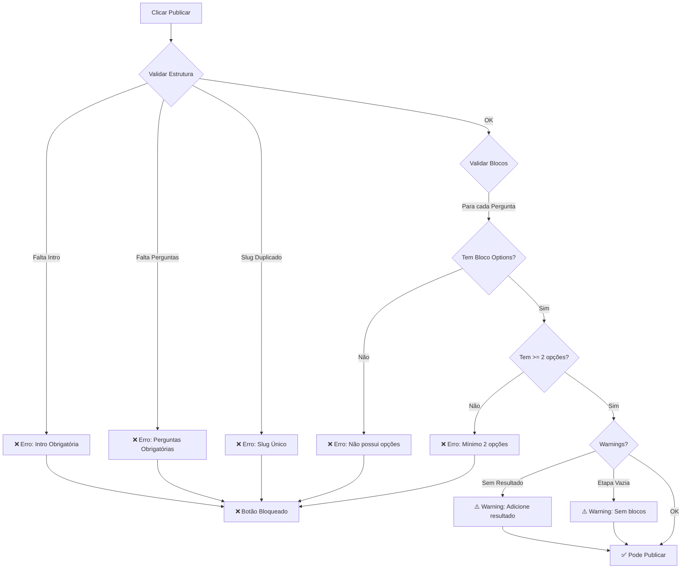

# 🔍 Estrutura Real das Validações de Publicação

## 📋 Como as Validações Funcionam

Baseado no código real em `src/hooks/usePublishFunnel.ts`, as validações ocorrem em **3 níveis**:

### 1️⃣ Validações de Estrutura de Etapas

#### ❌ **ERROS (Bloqueiam Publicação)**

| Validação                  | Condição                                                                             | Mensagem                                           |
| -------------------------- | ------------------------------------------------------------------------------------ | -------------------------------------------------- |
| **Intro Obrigatória**      | `stages.filter(s => s.type === 'intro').length === 0`                                | "É necessário pelo menos uma etapa de introdução"  |
| **Perguntas Obrigatórias** | `stages.filter(s => s.type === 'question' \|\| s.type === 'strategic').length === 0` | "É necessário pelo menos uma etapa de pergunta"    |
| **Slug Único**             | Slug já existe em funil publicado                                                    | "Já existe um funil publicado com o slug '{slug}'" |

### 2️⃣ Validações de Blocos de Opções

#### ❌ **ERROS (Bloqueiam Publicação)**

Para cada etapa de pergunta (`type === 'question'` ou `type === 'strategic'`):

```typescript
const blocks = stageBlocks[stage.id] || [];
const optionsBlock = blocks.find((b) => b.type === "options");

// Validação 1: Bloco existe?
if (!optionsBlock) {
  errors.push({
    message: `A etapa "${stage.title}" não possui opções configuradas`,
  });
}

// Validação 2: Tem pelo menos 2 opções?
else if (optionsBlock.content?.options?.length < 2) {
  errors.push({
    message: `A etapa "${stage.title}" precisa de pelo menos 2 opções`,
  });
}
```

**Exemplo Real:**

```
❌ A etapa "Questão 1 - Tipo de Roupa" não possui opções configuradas
❌ A etapa "Questão 2 - Personalidade" não possui opções configuradas
❌ A etapa "Questão 3 - Visual" não possui opções configuradas
❌ A etapa "Questão 4 - Detalhes" não possui opções configuradas
```

### 3️⃣ Validações de Conteúdo (Warnings)

#### ⚠️ **WARNINGS (Não Bloqueiam Publicação)**

| Validação               | Condição                             | Mensagem                                           |
| ----------------------- | ------------------------------------ | -------------------------------------------------- |
| **Etapa Sem Resultado** | Não há etapa `type === 'result'`     | "Recomenda-se adicionar uma etapa de resultado"    |
| **Etapa Vazia**         | `stageBlocks[stage.id].length === 0` | "A etapa '{title}' não possui blocos configurados" |

## 🎯 Estrutura de Dados Esperada

### Estrutura de uma Etapa (Stage):

```typescript
interface Stage {
  id: string;
  title: string;
  type: "intro" | "question" | "strategic" | "result";
  order: number;
  config?: Record<string, unknown>;
}
```

### Estrutura de um Bloco de Opções:

```typescript
interface CanvasBlock {
  id: string;
  type: "options"; // Tipo específico para bloco de opções
  order: number;
  content: {
    options: Array<{
      id: string;
      label: string;
      value: string;
      imageUrl?: string;
      // ... outras propriedades
    }>;
    // ... outras propriedades de content
  };
}
```

### Estrutura do stageBlocks:

```typescript
const stageBlocks: Record<string, CanvasBlock[]> = {
  'stage-id-1': [
    { id: 'block-1', type: 'heading', ... },
    { id: 'block-2', type: 'options', content: { options: [...] } },
    // ^ Este bloco é OBRIGATÓRIO para etapas de pergunta
  ],
  'stage-id-2': [
    // ...
  ]
}
```

## 🔧 Como Corrigir os Erros

### Erro: "não possui opções configuradas"

**Causa:** A etapa de pergunta não tem um bloco do tipo `'options'` adicionado.

**Solução:**

1. Abrir a etapa no editor
2. Clicar em "Adicionar Bloco"
3. Selecionar "Opções de Resposta" ou "Options"
4. Adicionar o bloco à etapa

**No código:**

```typescript
// O array de blocos DEVE conter pelo menos um bloco com type: 'options'
const blocks = [
  { id: "block-1", type: "heading", content: { text: "Pergunta..." } },
  {
    id: "block-2",
    type: "options",
    content: {
      options: [
        { id: "opt-1", label: "Opção 1", value: "1" },
        { id: "opt-2", label: "Opção 2", value: "2" },
      ],
    },
  },
];
```

### Erro: "precisa de pelo menos 2 opções"

**Causa:** O bloco de opções existe, mas tem menos de 2 opções no array.

**Solução:**

1. Abrir o bloco de opções na etapa
2. Adicionar mais opções até ter pelo menos 2
3. Salvar as alterações

**No código:**

```typescript
// Array options DEVE ter pelo menos 2 elementos
content: {
  options: [
    { id: "opt-1", label: "Opção 1", value: "1" }, // ✅
    { id: "opt-2", label: "Opção 2", value: "2" }, // ✅
  ];
}
```

## 📊 Fluxo de Validação Completo



## 🧪 Testes Implementados

### TC09: Validação de Bloco de Opções

```typescript
test("TC09: Deve validar que perguntas tenham blocos de opções configurados", async ({
  page,
}) => {
  // 1. Abre funil no editor
  // 2. Clica em Publicar
  // 3. Verifica mensagem: "não possui opções configuradas"
  // 4. Conta quantas etapas têm o problema
});
```

### TC09b: Validação de Quantidade Mínima

```typescript
test("TC09b: Deve validar quantidade mínima de opções (pelo menos 2)", async ({
  page,
}) => {
  // 1. Abre funil no editor
  // 2. Clica em Publicar
  // 3. Verifica mensagem: "precisa de pelo menos 2 opções"
  // 4. Conta quantas etapas têm o problema
});
```

## 📝 Exemplo Prático

### Cenário: Funil com 4 Perguntas Sem Opções

**Estrutura:**

```typescript
stages: [
  { id: '1', type: 'intro', title: 'Bem-vindo' },
  { id: '2', type: 'question', title: 'Questão 1 - Tipo de Roupa' },
  { id: '3', type: 'question', title: 'Questão 2 - Personalidade' },
  { id: '4', type: 'question', title: 'Questão 3 - Visual' },
  { id: '5', type: 'question', title: 'Questão 4 - Detalhes' }
]

stageBlocks: {
  '1': [{ type: 'heading', content: { text: 'Bem-vindo' } }],
  '2': [{ type: 'heading', content: { text: 'Pergunta 1' } }], // ❌ SEM OPTIONS
  '3': [{ type: 'heading', content: { text: 'Pergunta 2' } }], // ❌ SEM OPTIONS
  '4': [{ type: 'heading', content: { text: 'Pergunta 3' } }], // ❌ SEM OPTIONS
  '5': [{ type: 'heading', content: { text: 'Pergunta 4' } }]  // ❌ SEM OPTIONS
}
```

**Resultado da Validação:**

```
❌ Erros (4):
- A etapa "Questão 1 - Tipo de Roupa" não possui opções configuradas
- A etapa "Questão 2 - Personalidade" não possui opções configuradas
- A etapa "Questão 3 - Visual" não possui opções configuradas
- A etapa "Questão 4 - Detalhes" não possui opções configuradas

❌ Publicação BLOQUEADA
```

### Correção:

```typescript
stageBlocks: {
  '2': [
    { type: 'heading', content: { text: 'Pergunta 1' } },
    { type: 'options', content: {
      options: [
        { id: 'o1', label: 'Casual', value: 'casual' },
        { id: 'o2', label: 'Formal', value: 'formal' }
      ]
    }}
  ], // ✅ AGORA TEM OPTIONS
  // ... adicionar bloco options nas outras etapas
}
```

**Resultado após correção:**

```
✅ Sem erros
⚠️ Warnings (0)

✅ Publicação PERMITIDA
```

## 🎓 Conclusão

Os testes agora refletem **exatamente** a estrutura real:

1. ✅ **TC09** valida que blocos de opções existem
2. ✅ **TC09b** valida que há pelo menos 2 opções
3. ✅ Mensagens de erro testadas correspondem às mensagens reais
4. ✅ Lógica de validação segue o código fonte

---

**Arquivo de referência:** `src/hooks/usePublishFunnel.ts` (linhas 28-150)  
**Última atualização:** Dezembro 2025
