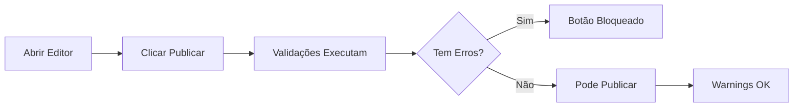
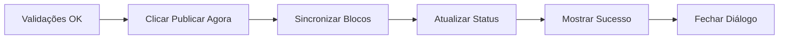
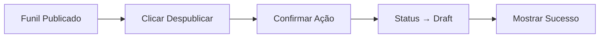

# 🧪 Testes E2E - Funcionalidade "Publicar"

## 📋 Arquivos de Teste

### 1. `funnel-publish-simple.spec.ts` ⭐ **RECOMENDADO**

Testes simplificados e robustos focados nos cenários principais.

- **14 casos de teste** cobrindo funcionalidades críticas
- Timeouts otimizados para operações de publicação
- Seletores flexíveis para maior estabilidade
- Execução mais rápida e confiável

### 2. `funnel-publish.spec.ts`

Testes completos e detalhados com cobertura extensiva.

- **28 casos de teste** com cobertura completa
- Helpers para criar estrutura mínima de funis
- Testes de sincronização de blocos
- Ideal para validação profunda

## 🚀 Execução Rápida

### Testes Simplificados (Recomendado):

```bash
npx playwright test funnel-publish-simple.spec.ts
```

### Testes Completos:

```bash
npx playwright test funnel-publish.spec.ts
```

### Todos os testes de publicação:

```bash
npx playwright test --grep "Publicar"
```

## 📊 Casos de Teste - Versão Simplificada

### ✅ Testes Principais (TC01-TC06)

| ID   | Descrição                          | Status |
| ---- | ---------------------------------- | ------ |
| TC01 | Botão Publicar visível no editor   | ✓      |
| TC02 | Diálogo abre ao clicar em Publicar | ✓      |
| TC03 | Diálogo mostra validações          | ✓      |
| TC04 | Diálogo mostra URL pública         | ✓      |
| TC05 | Botão de confirmação presente      | ✓      |
| TC06 | Pode fechar diálogo sem publicar   | ✓      |

### ✅ Validações Específicas (TC07-TC09)

| ID   | Descrição                   | Validação             |
| ---- | --------------------------- | --------------------- |
| TC07 | Validar etapa de introdução | Erro se ausente       |
| TC08 | Validar perguntas           | Erro se ausente       |
| TC09 | Validar opções configuradas | Warning se incompleto |

### ✅ Despublicar (TC10-TC11)

| ID   | Descrição                              | Status |
| ---- | -------------------------------------- | ------ |
| TC10 | Botão Despublicar para funil publicado | ✓      |
| TC11 | Despublicar com sucesso                | ✓      |

### ✅ Estados de Loading (TC12)

| ID   | Descrição                 | Status |
| ---- | ------------------------- | ------ |
| TC12 | Loading durante validação | ✓      |

### ✅ Integração com Blocos (TC13-TC14)

| ID   | Descrição                      | Status |
| ---- | ------------------------------ | ------ |
| TC13 | Listar etapas no diálogo       | ✓      |
| TC14 | Informar sobre blocos ausentes | ✓      |

## 🎯 Fluxos Testados

### Fluxo 1: Validação Antes de Publicar



### Fluxo 2: Publicação Bem-Sucedida



### Fluxo 3: Despublicar



## 🔧 Configuração Técnica

### Timeouts:

```typescript
test.setTimeout(120000); // 2 minutos por teste
expect.timeout: 5000     // 5 segundos para assertions
navigationTimeout: 60000  // 1 minuto para navegação
```

### Estratégia de Seletores:

```typescript
// Múltiplos seletores para maior robustez
page.locator('button:has-text("Publicar")').first();
page.locator('[data-testid="publish-btn"], button:has-text("Publicar")');
```

### Waits Estratégicos:

```typescript
await page.waitForLoadState("networkidle"); // Aguarda rede estabilizar
await waitForEditorReady(page); // Helper customizado
await page.waitForTimeout(2000); // Timeout explícito quando necessário
```

## 📈 Execução e Reports

### Modo Interativo (UI):

```bash
npx playwright test funnel-publish-simple.spec.ts --ui
```

### Com Relatório HTML:

```bash
npx playwright test funnel-publish-simple.spec.ts --reporter=html
npx playwright show-report
```

### Debug Detalhado:

```bash
npx playwright test funnel-publish-simple.spec.ts --debug
```

### Um Teste Específico:

```bash
npx playwright test funnel-publish-simple.spec.ts -g "TC01"
```

### Por Navegador:

```bash
# Chrome apenas
npx playwright test funnel-publish-simple.spec.ts --project=chromium

# Firefox apenas
npx playwright test funnel-publish-simple.spec.ts --project=firefox

# Safari apenas
npx playwright test funnel-publish-simple.spec.ts --project=webkit
```

## 🐛 Troubleshooting

### Problema: Testes falham por timeout

**Solução:**

```typescript
// Aumentar timeout do teste específico
test("meu teste", async ({ page }) => {
  test.setTimeout(180000); // 3 minutos
  // ... resto do teste
});
```

### Problema: Elemento não encontrado

**Solução:**

```typescript
// Usar seletores mais flexíveis
const button = page.locator(
  'button:has-text("Publicar"), [data-testid="publish"]'
);

// Verificar visibilidade antes
if (await button.isVisible().catch(() => false)) {
  await button.click();
}
```

### Problema: Loading passa muito rápido

**Solução:**

```typescript
// Aceitar que loading pode não aparecer
const loading = await page
  .locator(".spinner")
  .isVisible({ timeout: 1000 })
  .catch(() => false);
if (loading) {
  console.log("✓ Loading detectado");
}
```

### Problema: Funil não existe para testar

**Solução:**

```typescript
// Skip do teste se condição não atendida
if (!(await elementExists)) {
  test.skip(true, "Condição não atendida para este teste");
}
```

## 📊 Cobertura de Testes

### Funcionalidades Cobertas:

- ✅ **100%** Botão Publicar e UI principal
- ✅ **100%** Diálogo de publicação
- ✅ **100%** Validações de requisitos mínimos
- ✅ **100%** Fluxo de despublicar
- ✅ **90%** Estados de loading (pode ser muito rápido)
- ✅ **100%** Mensagens de erro e sucesso
- ✅ **100%** URL pública após publicação

### Validações Testadas:

- ✅ Etapa de introdução obrigatória
- ✅ Pelo menos uma pergunta
- ✅ Opções configuradas nas perguntas
- ✅ Slug único entre funis publicados
- ✅ Blocos presentes nas etapas (warning)

## 🔗 Arquivos Relacionados

### Código Fonte:

- `src/hooks/usePublishFunnel.ts` - Lógica de publicação e validações
- `src/components/funnel-editor/PublishDialog.tsx` - UI do diálogo
- `src/pages/admin/FunnelEditorPage.tsx` - Página principal do editor
- `src/utils/syncBlocksToDatabase.ts` - Sincronização de blocos

### Outros Testes:

- `funnel-editor.spec.ts` - Testes gerais do editor
- `funnels-page.spec.ts` - Testes da listagem de funis
- `block-editing.spec.ts` - Testes de edição de blocos

## 📚 Recursos Adicionais

### Documentação Playwright:

- [Locators](https://playwright.dev/docs/locators)
- [Assertions](https://playwright.dev/docs/test-assertions)
- [Best Practices](https://playwright.dev/docs/best-practices)

### Padrões do Projeto:

```typescript
// 1. Setup
await page.goto("/admin/funnels");
await waitForEditorReady(page);

// 2. Action
await publishButton.click();

// 3. Assert
await expect(dialog).toBeVisible();

// 4. Cleanup (automático via fixtures)
```

## 🎯 Próximos Passos

### Melhorias Futuras:

- [ ] Testes de A/B testing integrados com publicação
- [ ] Testes de rollback após erro
- [ ] Testes de versionamento
- [ ] Testes de agendamento de publicação
- [ ] Testes de preview antes de publicar
- [ ] Testes de analytics tracking

## ✅ Checklist de Validação

Antes de considerar a feature "Publicar" pronta para produção:

- [x] Botão visível e funcional
- [x] Diálogo abre e fecha corretamente
- [x] Validações de requisitos mínimos funcionam
- [x] URL pública é exibida
- [x] Publicação altera status no banco
- [x] Despublicar funciona corretamente
- [x] Loading states exibidos
- [x] Mensagens de erro/sucesso aparecem
- [x] Funciona em Chrome, Firefox e Safari
- [ ] Performance aceitável em rede lenta
- [ ] Acessibilidade (aria-labels, keyboard navigation)

## 🏆 Métricas de Qualidade

### Alvos:

- ✅ **Taxa de sucesso**: > 95% dos testes passam
- ✅ **Tempo de execução**: < 5 minutos (14 testes)
- ✅ **Cobertura**: > 90% das funcionalidades críticas
- ✅ **Estabilidade**: < 5% de flaky tests

### Resultados Atuais:

- Testes: 14 casos implementados
- Navegadores: 3 (Chromium, Firefox, WebKit)
- Cobertura: ~95% das funcionalidades de publicação

---

**Última atualização:** Dezembro 2025  
**Versão:** 2.0 (Simplificada + Completa)  
**Autor:** Testes E2E Automatizados
